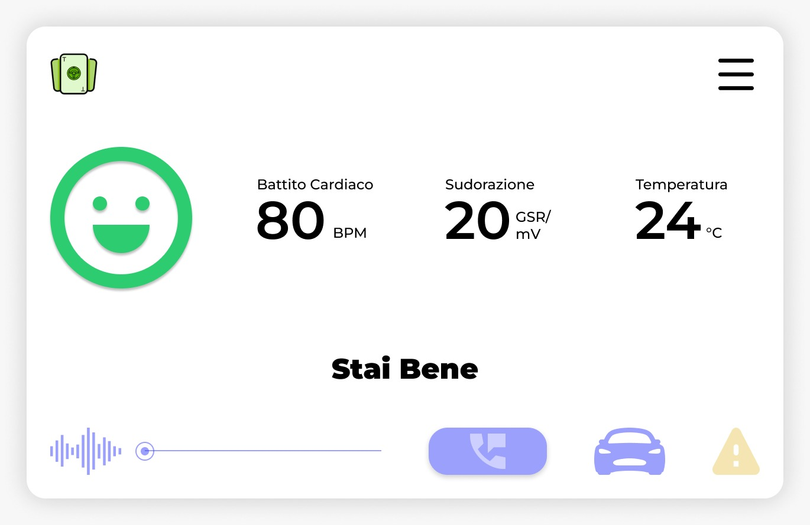
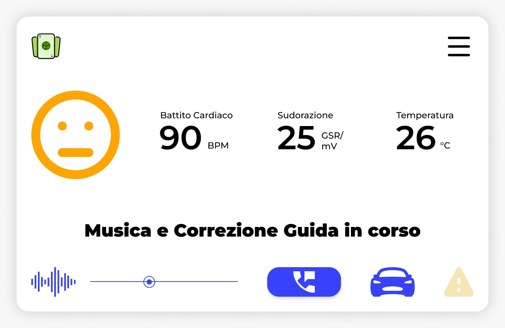
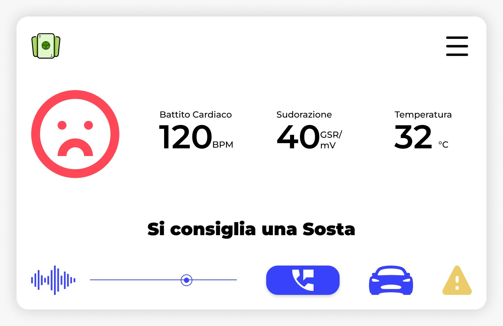

# SamsungCampus22

## Abstract
Car rental and car sharing are realities that have become established in our daily lives. Their use has become more and more frequent and the number of companies in this regard is growing day by day. In Italy, more than one million people rely on this service, giving up the car they own, and the number is constantly increasing. In fact, there has been a 28.6% increase in enrollment in the past year. Companies need to stand out from their competitors, and customers need to be able to choose the solution that provides them with a good quality of service, especially in situations unrelated to them. Although 95% of people between the ages of 18 and 65 are licensed, according to data collected by the Ministry of Infrastructure and Transportation, a good portion of the population feels uncomfortable driving. According to some research, 33% of the population suffers from Amaxophobia (from the Greek, "hàmaxa" meaning chariot and "phobos" meaning fear). It is a discomfort that is triggered the moment a person gets behind the wheel or it can be occurring in an anticipatory way, at the mere thought of where to drive. Italy is not the only country to suffer from it. According to the MAPFRE Institute, in research coordinated by Dr. Antonio García Infanzón, 7.2 million Spanish motorists suffer from it, and they externalize it in extremely different ways: most, 82%, manifest a mild feeling of nervousness and anxiety behind the wheel, especially in difficult conditions, such as driving at night, during torrential rain, in dense fog or when there are other people on board, especially if children. Six percent of amaxophobes, again according to that research, have completely lost the ability to be behind the wheel: they suffer from a form of "paralyzing fear," pure terror, when they sit in the driver's seat, and for this reason they have given up their driver's licenses and simply get into the car when it is driven by someone else or, even better, rely on public transportation.  
Even those who do not suffer from amaxophobia can have difficulty driving, especially if they have not done so for some time. This may be the case for Chiara, 27, who learned to drive when she was 18 and has stopped since she moved to London for work. Chiara has always moved around the city thanks to public transportation, but it is not always reliable; strikes or breakdowns can happen that block the service, perhaps in conjunction with an event that is important to her. Leaving aside the added difficulty of right-hand drive, Chiara most likely rules out the possibility of using a car share precisely because she has not driven for a long time and feels that she is a danger to herself and others.  
The problem also arises for those who feel safe driving but are in an unfamiliar context. As happened to Marco, who a month ago went with his girlfriend Sofia to Istanbul, one of the busiest cities in the world, and had a bad time driving, even though his car was semi-autonomous, precisely because he did not know the place and the roads.  
These are all situations that could convince the user not to rent a car due to lack of confidence. 
True, autonomous and semi-autonomous cars lend a big hand in these cases. But that is not enough. What is needed is a device that improves the experience for the user who is having difficulty driving or reassures them even before they get behind the wheel. 

## Our product
Our solution is a smarttband, equipped with sensors aimed at measuring body temperature, heart rate, sweating and the driver's galvanic response. The bracelet monitors the driver's stress state and communicates with the car to perform certain actions.  
Three main stress levels are identified:  
1. **No stress**  
  
In case the user is not stressed, the autonomous (or semi-autonomous that is) car will continue without any change. The bracelet will continue to monitor the driver.  

2. **Mild stress from change of environment**  
  
In the case of a slight increase in heart rate, the bracelet will notify the car of the driver's state and trigger certain functions, such as starting soothing background music and changing the route to a less busy and difficult road. Other functions that could be implemented could be encouraging air recirculation through window opening or changing car brightness (a momentary state of photophobia can raise the driver's stress level, according to a Bavaria Clinic study conducted by Dr. Marco Moschi).  

3. **High stress**  
  
The last level, on the other hand, is the most interactive. The functions of route change and music remain, but in case the stress does not hint at going down it will be the car itself that will recommend a stop to the passenger and give the user the opportunity to contact the carsharing company's assistance.  
The data will be collected, analyzed and processed by us, and the Car Sharing company will have a record of the drivers' driving behavior. Thus, we directly address the companies by proposing a device that will reassure the driver in stressful situations.  

## Why buy the product ?
Because we are able, through our product, to broaden the car rental catchment area to include that segment of people who suffer from amaxophobia or are wont to avoid the driving environment in general, bringing in new customers who would otherwise have preferred other solutions considered by them to be safer.  
In addition, we are a driver's ace in the hole ("*Trump card*"), ensuring an enjoyable driving experience. A satisfied customer will not need to look for another company to rely on. This will create a Costumer Retention mechanism, which will bring more profit to the company. In short, more and more consistent customers.  
The data collected and processed will be sent to the company on a monthly basis. An activity census will be conducted by us for each car equipped with a wristband. The drivers' data will be anonymous, but the stress levels collected may be useful to the company for upcoming market decisions. For example, if it is noticed that one car has been collecting higher stress levels on average than others, we will take care of pointing out this data to the company so that she can act accordingly (perform a vehicle overhaul or review agreements with that particular brand). They can also be used as a bragging point for advertising campaigns. 

